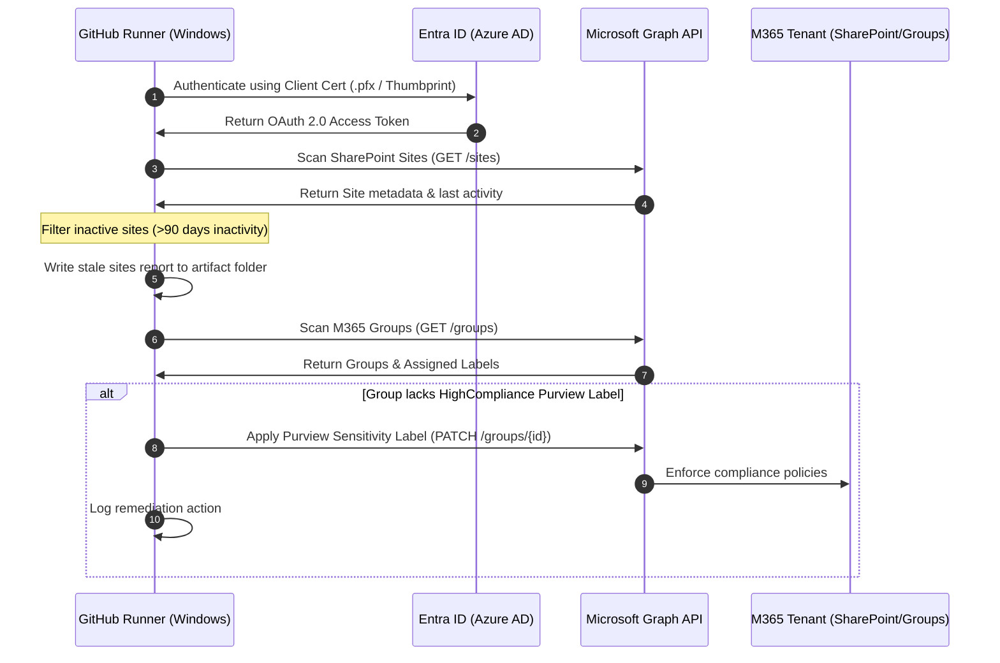

# Architecture Deep Dive: Aurora Workspace Governance Engine

## 1. Executive Summary
The **Aurora Workspace Governance Engine** is an architecture-as-code automation platform built to govern Microsoft 365 services (SharePoint Online, MS Teams, M365 Groups) in a secure, non-interactive, passwordless environment. 

By utilizing **Azure Active Directory (Entra ID) App Registrations** authenticated via a **Self-Signed Client Certificate**, the engine runs automated scheduled actions (using GitHub Actions) to enforce data classifications, sweep for inactive or orphaned collaborative spaces, and minimize the risk of data sprawl.

---

## 2. Structural Architecture Flow

Below is the logical flow of authentication, detection, remediation, and reporting executed by the engine:



---

## 3. Core Architectural Pillars

### 3.1 Secure Certificate-Based Authentication
Password-based authentication (Client Secrets) presents a significant security liability. To establish a secure operational workflow, the system uses **Certificate-Based Authentication (CBA)**:
* **Private Key Storage**: The private key (`.pfx`) is securely uploaded to the execution runner environment (GitHub Secrets).
* **Public Key Registration**: The public certificate (`.cer`) is uploaded directly to the Entra ID Application registration.
* **Authentication Handshake**: `Connect-MgGraph` authenticates by matching the cryptographic thumbprint of the client certificate, avoiding credentials exposure.

### 3.2 Automated Inactivity Audit
To mitigate data sprawl and reduce license overhead, the scanning routine evaluates SharePoint site inactivity based on parameterized settings from `TenantSettings.json`:
* **Configurable Thresholds**: Define inactivity periods (default `90` days).
* **Target Date Calculations**: Script programmatically computes the threshold date relative to the current timestamp.
* **M365 Site Scan**: Hits Microsoft Graph's `/sites` endpoint to parse `webUrl` and `lastModifiedDateTime`.
* **Out-of-band Reporting**: Exports identified stale sites to a JSON report for further processing or dashboard ingestion.

### 3.3 Programmatic Compliance Remediation
Data security is enforced by aligning collaborative workspaces with **Microsoft Purview** sensitivity guidelines:
* **Sensitivity Verification**: Iterates through all tenant unified groups to query the `assignedLabels` field.
* **Remediation Loop**: Programmatically updates groups lacking the required labels with a `PATCH` request to Microsoft Graph, assigning the target `HighCompliance` label UUID (`e305282a-e374-4b55-bb55-ec91cf549c69`).

---

## 4. Environment Parameters & Deployment Topology

The engine isolates environment values from code files using external JSON files and GitHub secrets:

```
                  ┌──────────────────────┐
                  │  TenantSettings.json │  <-- Inactivity threshold, alerts, labels
                  └──────────┬───────────┘
                             │
                             ▼
┌──────────────────┐   ┌───────────┐   ┌──────────────────────┐
│  GitHub Secrets  ├──>│ CI/CD Job ├──>│ Connect-MgGraph      │
│  (Cert / IDs)    │   │ (Runner)  │   │ (App Authentication) │
└──────────────────┘   └───────────┘   └──────────┬───────────┘
                                                  │
                                                  ▼
                                       ┌──────────────────────┐
                                       │ Microsoft Graph APIs │
                                       └──────────────────────┘
```

* **External Configurations**: Managed via [TenantSettings.json](../Configuration/TenantSettings.json).
* **Hardened Configurations**: Defined in [SecureTeamsTemplate.xml](../Configuration/SecureTeamsTemplate.xml) to enforce architectural baselines (disabling custom app embedding, blocking guests, requiring Purview labels) during team provisioning.
