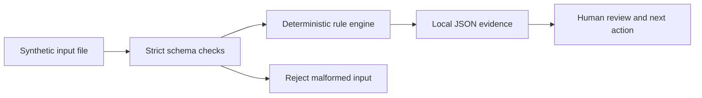

# Architecture and operational handover

Identity boundary: no service account, tokens, network integration or tenant mutation. Logs are inert strings. The synthetic IDs do not identify real people or devices. Optional Windows/Intune/Defender procedures require an isolated tenant, verified entitlement, scoped permission and a human change owner. All portal, service and endpoint exercises are unrun.

Source layout follows the existing tenant-guard project's lowercase scripts/templates/docs convention. Source and fixtures here are original; no code from that exemplar was copied. Standard library dependencies only. Outputs are deterministic for the supplied snapshot and fixed clock or findings. Never ingest private production diagnostics into the public repository.

Operation: use the exact commands in README.md from the project root. Inspect output scope and unknown fields, run the behavioural tests, then have a human decide the next action. No script output authorises access or a change. Preserve original evidence and a versioned note before modifying fixtures. If malformed input rejects, retain its error and restore the original source; empty input means no data, not a healthy estate.

Production gaps: authorisation, input provenance/freshness, service pagination/throttling, secure storage, real identities, role design, notification consent, concurrency, change audit, monitoring, deployment/rollback and operational ownership have not been implemented or validated. The tested offline slice is deliberately smaller.
