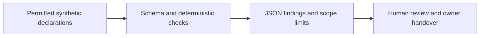

# Architecture and operational boundaries

Only local file reads and standard output occur. No token storage, network request or tenant mutation exists. The source cannot independently verify the declarations. Human approval, complete collection and effective access are outside the implemented boundary. Low counts and provider status do not establish business impact or root cause.

Data stays synthetic in public evidence. Actual tenant exports, identities, incident notes and credentials belong in an approved private store. An adapter must be evaluated separately before its results are accepted. The lab's numeric thresholds are explicit illustrative choices; a business owner would approve operational policy.

Decision: keep deterministic rules as the default. AI has no role in permission approval or acceptance; any future explanation must be grounded, evaluated against a template baseline and optional.
