# ContentFlow — AI-Powered Cross-Platform Content Repurposing Engine

## Problem Statement

Content creators produce long-form content (e.g., a Substack blog post) and then must **manually** rewrite, resize, and reformat that content for every additional platform. Worse — they post at random times, have no sequencing strategy, no performance data, and no insight into whether their content strategy is achieving its goals.

**ContentFlow** solves this with an **AI-powered pipeline** that takes a raw brain dump, refines it, tailors it for each platform, schedules it for optimal engagement, sequences posts into audience journeys, and tracks performance against defined objectives.

---

## Product Vision

### The 4-Stage Content Pipeline

```mermaid
graph LR
    A["🧠 BRAIN DUMP<br/>Raw ideas, rough draft,<br/>stream of consciousness"] 
    -->|"AI Refines"| 
    B["✍️ REFINED DRAFT<br/>Structured, polished,<br/>clear narrative"]
    -->|"AI Tailors"| 
    C["🎯 PLATFORM DRAFTS<br/>LinkedIn version<br/>Instagram version<br/>YouTube version"]
    -->|"Automation Engine"| 
    D["📤 POSTING<br/>Optimal timing<br/>Journey sequencing<br/>Queue management"]
    -->|"Analytics"| 
    E["📊 PERFORMANCE<br/>OKR tracking<br/>Engagement metrics<br/>Learning feedback"]
    E -->|"AI Learns"| A
```

| Stage | What Happens | AI Role |
|-------|-------------|---------|
| **1. Brain Dump** | Creator pastes raw ideas, rough notes, stream of consciousness | AI analyzes intent, identifies key messages, detects content pillars |
| **2. Refined Draft** | AI transforms brain dump into a polished, structured piece | AI rewrites for clarity, adds structure, suggests hooks, CTAs, and engagement triggers |
| **3. Platform Tailoring** | AI creates optimized versions for each selected platform | AI applies platform rules, tone, format, hashtags, audience context, and learned patterns |
| **4. Posting** | Automation engine schedules and publishes at optimal times in a journey sequence | AI determines best posting times, orders queue to build narrative journey for audience |

### Key Concepts: Project → Product → Artifact

| Concept | Definition | Example |
|---------|-----------|---------|
| **Project** | The overarching initiative | *ContentFlow — the AI-powered content engine* |
| **Product** | A deliverable unit of the project | *AI Engine*, *Automation Engine*, *Analytics Dashboard*, *Learning System* |
| **Artifact** | A concrete output produced by the system | *A refined draft*, *an Instagram carousel caption*, *a weekly OKR report*, *an audience journey map* |

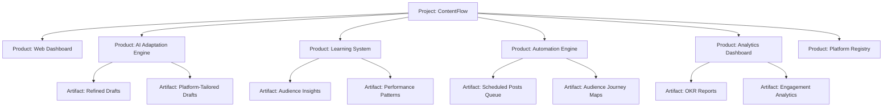

---

## Confirmed Decisions

| Decision | Answer |
|----------|--------|
| **Default AI Provider** | **Gemini** (via `@google/generative-ai` SDK). Strategy pattern allows adding OpenAI/Claude later. |
| **Phase 1 Platforms** | **LinkedIn**, **Instagram**, **YouTube** |
| **Phase 2 Platforms** | TikTok, Facebook, X/Twitter |
| **Feedback Model** | Manual feedback in v1 (approve/edit/reject/rate). Platform analytics APIs in a future phase. |
| **Content Flow** | Brain Dump → Refined Draft → Platform-Tailored Drafts → Posting |
| **Automation** | Optimal-time scheduling, queue management, journey-based sequencing |
| **Analytics** | Post performance tracking, OKR achievement measurement |

---

## Architecture & Design Patterns

### SOLID Principles — Deep Application

| Principle | Application |
|-----------|------------|
| **S**ingle Responsibility | `RefinementService` refines drafts. `AutomationEngine` handles scheduling. `AnalyticsService` tracks metrics. `JourneyPlanner` sequences posts. No class does two jobs. |
| **O**pen/Closed | New AI providers, platforms, analytics metrics, and queue strategies added via new classes — zero changes to existing code. |
| **L**iskov Substitution | All `AIProvider` implementations, `PlatformAdapter` implementations, and `QueueStrategy` implementations are fully interchangeable. |
| **I**nterface Segregation | `Adaptable`, `Schedulable`, `Trackable`, `Learnable`, `Suggestable` — each consumer depends only on what it needs. |
| **D**ependency Inversion | `AutomationEngine` depends on `Scheduler` abstraction, not `node-cron` directly. `AnalyticsService` depends on `MetricsStore` abstraction, not SQLite. |

### Design Patterns

| Pattern | Where | Why |
|---------|-------|-----|
| **Strategy** | `AIProvider`, `PlatformAdapter`, `QueueStrategy` | Swap AI backends, platform rules, and queue algorithms independently |
| **Factory** | `AIProviderFactory`, `AdapterFactory` | Create correct instances from config strings |
| **Template Method** | `BasePlatformAdapter` | Skeleton adaptation steps; subclasses override specifics |
| **Observer** | Pipeline events, feedback events, analytics events | UI reacts to progress; learning engine reacts to feedback; analytics reacts to post performance |
| **Builder** | `PromptBuilder`, `JourneyBuilder` | Compose complex AI prompts and content journey sequences |
| **Registry** | `PlatformRegistry`, `AIProviderRegistry` | Self-registering plugins for extensibility |
| **Pipeline** | `ContentPipeline` | Chain: parse → refine → tailor → schedule → post |
| **Repository** | `ContentRepository`, `AnalyticsRepository`, `QueueRepository` | Abstract data access behind clean interfaces |
| **Chain of Responsibility** | `SuggestionChain` | Stack suggestion generators; each adds recommendations or passes through |
| **Command** | `PostCommand`, `ScheduleCommand` | Encapsulate posting actions for queue, undo, and retry |
| **State** | `PostStateMachine` | Posts transition: `draft → refined → tailored → queued → scheduled → posted → tracked` |
| **Memento** | `ContentVersionHistory` | Track every version for learning from edit evolution |

### Post State Machine

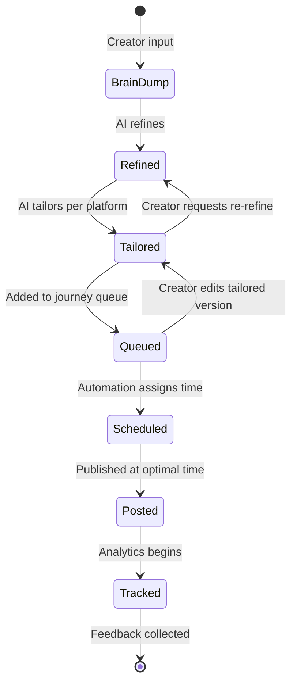

---

### System Architecture

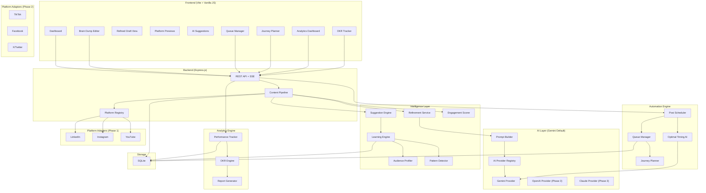

---

## AI Integration — The Intelligence Layer

### 1. Brain Dump → Refined Draft (AI Refinement)

The AI takes raw, unstructured input and produces a polished draft:

| What AI Does | How |
|-------------|-----|
| **Intent Detection** | Identifies the core message, supporting points, and desired outcome |
| **Structure Imposition** | Adds clear intro → body → conclusion flow |
| **Clarity Rewriting** | Fixes grammar, tightens prose, removes redundancy |
| **Hook Generation** | Creates an attention-grabbing opening line |
| **CTA Suggestion** | Adds a call-to-action aligned with the creator's objectives |
| **Keyword Extraction** | Identifies SEO and discoverability keywords |
| **Tone Calibration** | Matches the creator's learned brand voice |

### 2. Refined Draft → Platform-Tailored Drafts (AI Adaptation)

Each platform adapter constructs context-rich prompts via the `PromptBuilder`:

```
┌──────────────────────────────────────────────────┐
│              PROMPT COMPOSITION                  │
├──────────────────────────────────────────────────┤
│ 1. System Role: Platform content expert          │
│ 2. Platform Rules: Char limits, tone, format     │
│ 3. Refined Content: The polished draft           │
│ 4. Audience Context: Learned preferences         │
│ 5. Performance History: What worked before       │
│ 6. Journey Context: Where this post fits in queue│
│ 7. OKR Alignment: Which objectives this serves   │
│ 8. Output Format: Structured JSON response       │
└──────────────────────────────────────────────────┘
```

#### Phase 1 Platform Adapters

| Adapter | Key Best Practices Encoded |
|---------|---------------------------|
| **LinkedIn** | 3,000 char limit, professional tone, line breaks for readability, 3-5 hashtags, thought-leadership framing, hook with data/contrarian take, ask for engagement in closing |
| **Instagram** | 2,200 char caption, 30 hashtag max, carousel-friendly bullet points, emoji-rich, CTA to bio link, story-driven, visual-first copy |
| **YouTube** | Script with timestamps, 5,000 char description, keyword-rich, chapters structure, hook in first 5 seconds, subscribe CTA, community engagement prompts |

### 3. Learning Engine — The System Gets Smarter

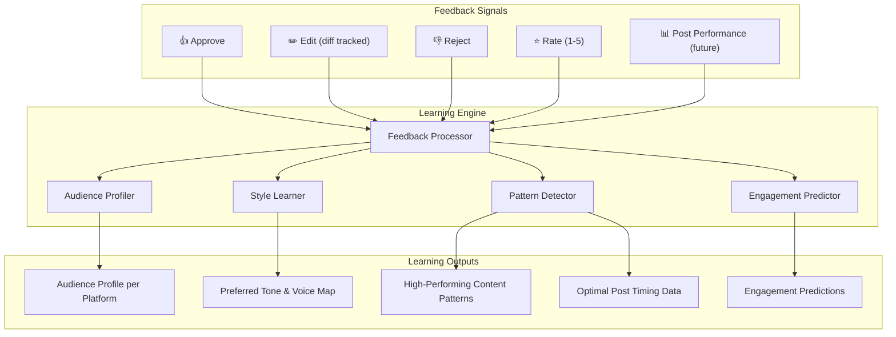

### 4. Suggestion Engine — Chain of Responsibility

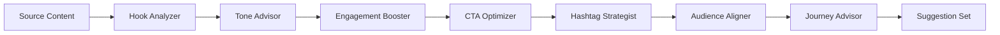

| Suggester | What It Does |
|-----------|-------------|
| **Hook Analyzer** | Evaluates opening line strength, suggests alternatives |
| **Tone Advisor** | Compares tone to what performs best per platform |
| **Engagement Booster** | Identifies missing engagement triggers (questions, polls, stories) |
| **CTA Optimizer** | Evaluates call-to-action effectiveness |
| **Hashtag Strategist** | AI-curated hashtags based on content + trending data |
| **Audience Aligner** | Checks content-audience fit via learned profiles |
| **Journey Advisor** | *New* — Ensures post fits the narrative arc of the queue |

### 5. Engagement Scoring

| Metric | Description |
|--------|------------|
| **Engagement Score** (0-100) | AI predicts likes/saves/shares based on learned patterns |
| **Hook Strength** (weak/medium/strong) | Opening line analysis vs. top performers |
| **Audience Fit** (0-100) | Match against learned audience profile |
| **Journey Coherence** (0-100) | How well this post connects to previous/next in queue |
| **OKR Alignment** (0-100) | How much this post contributes to defined objectives |

---

## Automation Engine

### Optimal Timing

The AI analyzes learned engagement patterns and external signals to schedule posts at the best times:

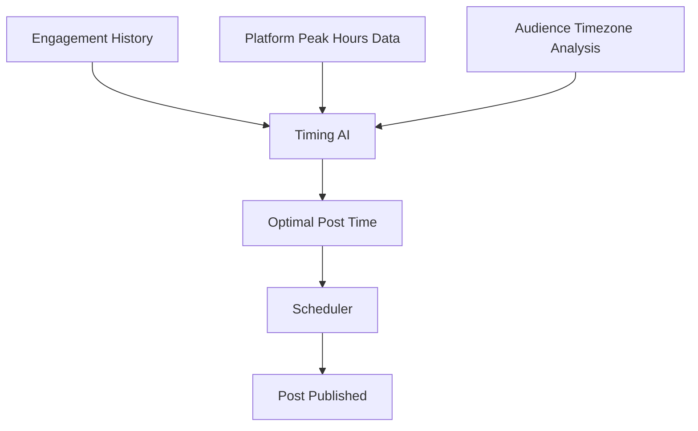

| Factor | How It's Used |
|--------|--------------|
| **Historical performance** | Which posting times got highest engagement for this creator |
| **Platform data** | General peak hours per platform (e.g., LinkedIn: Tue-Thu 8-10am) |
| **Audience patterns** | When this creator's specific audience is most active (learned) |
| **Content type** | Different content types perform better at different times |
| **Queue position** | Spacing posts for optimal visibility without audience fatigue |

### Journey-Based Queue System

Posts aren't just scheduled randomly — they're **sequenced to take the audience on a journey**. Each post builds on the previous one, creating a narrative arc:

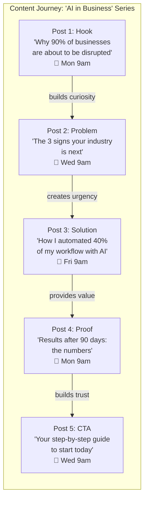

The `JourneyPlanner` uses AI to:

| Capability | Description |
|-----------|------------|
| **Narrative Arc Detection** | AI identifies the story arc in queued posts and suggests ordering |
| **Gap Analysis** | Detects missing beats in the journey (e.g., "You have the hook and solution but no proof post") |
| **Bridge Generation** | AI can suggest or generate "bridge" posts that connect two ideas |
| **Pacing Optimization** | Ensures posts are spaced for audience retention without fatigue |
| **Cross-Platform Sync** | Coordinates journey across platforms (LinkedIn deep-dive → Instagram teaser → YouTube explainer) |

### Queue Management

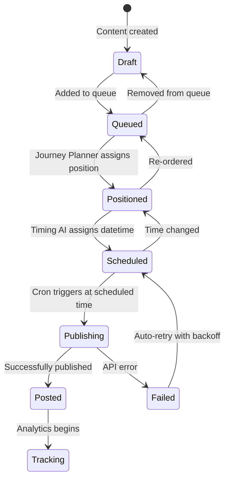

| Queue Feature | Description |
|--------------|------------|
| **Drag-and-drop reorder** | Manually reorder posts in the queue via UI |
| **AI-suggested order** | AI recommends optimal sequence based on journey analysis |
| **Platform grouping** | View queue per platform or cross-platform timeline |
| **Conflict detection** | Warns if two posts are scheduled too close together |
| **Preview timeline** | Visual timeline showing all scheduled posts across platforms |
| **Pause/Resume** | Pause entire queue or individual posts |

---

## Analytics Dashboard & OKR Tracking

### Post Performance Tracking

Every posted piece of content is tracked with both AI-predicted and actual metrics (manual entry in v1, API-fed in future):

```mermaid
graph TD
    subgraph PerPost ["Per-Post Analytics"]
        A["Engagement Score (predicted vs actual)"]
        B["Reach / Impressions"]
        C["Likes / Reactions"]
        D["Comments"]
        E["Shares / Reposts"]
        F["Saves / Bookmarks"]
        G["Click-throughs"]
        H["Follower Growth (attributed)"]
    end

    subgraph Aggregate ["Aggregate Analytics"]
        I["Platform Performance Comparison"]
        J["Content Type Performance"]
        K["Best Posting Times (validated)"]
        L["Audience Growth Trend"]
        M["Journey Completion Rate"]
        N["Content Velocity"]
    end

    subgraph OKR ["OKR Tracking"]
        O["Objective: Grow LinkedIn to 10K"]
        P["KR1: 3 posts/week → tracked"]
        Q["KR2: 5% engagement rate → tracked"]
        R["KR3: 50 inbound leads/month → tracked"]
    end
```

### OKR Engine

Creators define **Objectives and Key Results**, and ContentFlow tracks progress automatically:

```
OBJECTIVE: Establish thought leadership on LinkedIn
├── KR1: Publish 3x/week consistently        → Auto-tracked via queue
├── KR2: Achieve 5% avg engagement rate       → Auto-tracked via analytics
├── KR3: Grow followers by 2,000 this quarter → Manual input / API (future)
└── KR4: Generate 20 inbound DMs per month    → Manual input

OBJECTIVE: Build Instagram community
├── KR1: Post daily (stories + feed)          → Auto-tracked via queue
├── KR2: Reach 10K saves this quarter         → Manual input / API (future)
└── KR3: Carousel posts 2x/week              → Auto-tracked via content type
```

| OKR Feature | Description |
|------------|------------|
| **Define Objectives** | Free-text objectives with due dates |
| **Define Key Results** | Measurable KRs with targets, auto-tracked where possible |
| **Progress Visualization** | Progress bars, trend charts, on-track/at-risk/behind indicators |
| **AI Recommendations** | "To hit KR2, increase posting frequency to 4x/week based on your trend" |
| **Weekly Digest** | Auto-generated summary of OKR progress |

### Evolution Tracker

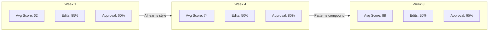

---

## Proposed Changes — Full File Structure

```
content-flow/
├── package.json
├── vite.config.js
├── .env.example                         # API keys template
│
├── server/
│   ├── index.js                         # Express entry point
│   ├── config.js                        # Configuration loader
│   │
│   ├── routes/
│   │   ├── content.routes.js            # Content CRUD
│   │   ├── adapt.routes.js              # Adaptation pipeline
│   │   ├── suggest.routes.js            # Suggestion engine
│   │   ├── learn.routes.js              # Feedback & learning
│   │   ├── queue.routes.js              # Queue management
│   │   ├── schedule.routes.js           # Scheduling & automation
│   │   ├── analytics.routes.js          # Performance analytics
│   │   └── okr.routes.js               # OKR tracking
│   │
│   ├── models/
│   │   ├── Content.js                   # Source content entity
│   │   ├── AdaptedContent.js            # Adapted content entity
│   │   ├── Feedback.js                  # User feedback entity
│   │   ├── AudienceProfile.js           # Learned audience model
│   │   ├── QueueItem.js                 # Queue entry entity
│   │   ├── Journey.js                   # Content journey entity
│   │   ├── PostMetrics.js               # Post performance entity
│   │   └── Objective.js                 # OKR entity
│   │
│   ├── services/
│   │   ├── ContentPipeline.js           # Full 4-stage orchestrator
│   │   ├── RefinementService.js         # Brain dump → refined draft
│   │   ├── ContentParser.js             # Parses raw content
│   │   ├── ExportService.js             # Export handlers
│   │   ├── LearningEngine.js            # Feedback → patterns
│   │   ├── SuggestionEngine.js          # Proactive suggestions
│   │   ├── EngagementScorer.js          # Predicts performance
│   │   ├── PatternDetector.js           # Identifies winning patterns
│   │   ├── AudienceProfiler.js          # Builds audience intelligence
│   │   ├── EvolutionTracker.js          # Tracks improvement
│   │   ├── PostStateMachine.js          # State transitions
│   │   └── DiffCalculator.js            # Edit diff for learning
│   │
│   ├── automation/
│   │   ├── AutomationEngine.js          # Main automation orchestrator
│   │   ├── PostScheduler.js             # Cron-based scheduling
│   │   ├── QueueManager.js              # Queue CRUD + ordering
│   │   ├── JourneyPlanner.js            # AI narrative sequencing
│   │   ├── TimingOptimizer.js           # AI optimal time calculation
│   │   └── PostPublisher.js             # Platform publishing (future API)
│   │
│   ├── analytics/
│   │   ├── AnalyticsService.js          # Performance tracking
│   │   ├── OKREngine.js                 # Objective tracking
│   │   ├── ReportGenerator.js           # Digest & report generation
│   │   └── MetricsAggregator.js         # Roll-up calculations
│   │
│   ├── ai/
│   │   ├── AIProvider.js                # Abstract base (Strategy)
│   │   ├── AIProviderFactory.js         # Factory
│   │   ├── AIProviderRegistry.js        # Registry
│   │   ├── PromptBuilder.js             # Builder pattern
│   │   ├── providers/
│   │   │   ├── GeminiProvider.js        # Default provider
│   │   │   ├── OpenAIProvider.js        # Phase 3
│   │   │   └── ClaudeProvider.js        # Phase 3
│   │   └── prompts/
│   │       ├── refinement.prompts.js    # Brain dump → refined
│   │       ├── adaptation.prompts.js    # Refined → platform
│   │       ├── suggestion.prompts.js    # Content suggestions
│   │       ├── scoring.prompts.js       # Engagement scoring
│   │       ├── journey.prompts.js       # Journey sequencing
│   │       └── timing.prompts.js        # Optimal timing
│   │
│   ├── adapters/
│   │   ├── BasePlatformAdapter.js       # Template Method
│   │   ├── AdapterFactory.js            # Factory
│   │   ├── PlatformRegistry.js          # Registry
│   │   ├── LinkedInAdapter.js           # Phase 1
│   │   ├── InstagramAdapter.js          # Phase 1
│   │   ├── YouTubeAdapter.js            # Phase 1
│   │   ├── TikTokAdapter.js             # Phase 2
│   │   ├── FacebookAdapter.js           # Phase 2
│   │   └── TwitterAdapter.js            # Phase 2
│   │
│   ├── suggestions/
│   │   ├── BaseSuggester.js             # Chain base
│   │   ├── HookAnalyzer.js
│   │   ├── ToneAdvisor.js
│   │   ├── EngagementBooster.js
│   │   ├── CTAOptimizer.js
│   │   ├── HashtagStrategist.js
│   │   ├── AudienceAligner.js
│   │   └── JourneyAdvisor.js            # New: narrative fit
│   │
│   ├── utils/
│   │   ├── textAnalyzer.js
│   │   ├── hashtagGenerator.js
│   │   └── contentTruncator.js
│   │
│   └── db/
│       ├── database.js
│       ├── repositories/
│       │   ├── ContentRepository.js
│       │   ├── FeedbackRepository.js
│       │   ├── LearningRepository.js
│       │   ├── QueueRepository.js
│       │   ├── AnalyticsRepository.js
│       │   └── OKRRepository.js
│       └── migrations/
│           └── 001_initial.sql
│
├── src/                                  # Frontend
│   ├── index.html
│   ├── main.js
│   ├── style.css                        # Premium design system
│   ├── components/
│   │   ├── BrainDumpEditor.js           # Raw input with AI refine button
│   │   ├── RefinedDraftView.js          # Polished draft with diff view
│   │   ├── PlatformSelector.js          # Visual toggle cards
│   │   ├── AdaptationPreview.js         # Platform mockup previews
│   │   ├── PipelineProgress.js          # Animated stage progress
│   │   ├── SuggestionPanel.js           # AI suggestions
│   │   ├── EngagementScoreCard.js       # Predicted metrics
│   │   ├── FeedbackWidget.js            # Approve/edit/reject/rate
│   │   ├── QueueManager.js             # Drag-and-drop queue
│   │   ├── JourneyTimeline.js           # Visual journey planner
│   │   ├── ScheduleCalendar.js          # Calendar view of scheduled posts
│   │   ├── AnalyticsDashboard.js        # Performance charts
│   │   ├── OKRTracker.js               # Objectives progress
│   │   ├── EvolutionDashboard.js        # Strategy growth
│   │   ├── AudienceInsightsPanel.js     # Audience intelligence
│   │   └── ExportPanel.js              # Copy/download/publish
│   ├── services/
│   │   └── api.js                       # Frontend API client
│   └── utils/
│       ├── dom.js                       # DOM helpers
│       └── charts.js                    # Charting utilities
│
└── tests/
    ├── ai/
    │   ├── promptBuilder.test.js
    │   └── geminiProvider.test.js
    ├── adapters/
    │   ├── linkedin.test.js
    │   ├── instagram.test.js
    │   └── youtube.test.js
    ├── services/
    │   ├── refinementService.test.js
    │   ├── learningEngine.test.js
    │   ├── suggestionEngine.test.js
    │   └── pipeline.test.js
    ├── automation/
    │   ├── queueManager.test.js
    │   ├── journeyPlanner.test.js
    │   └── timingOptimizer.test.js
    ├── analytics/
    │   ├── analyticsService.test.js
    │   └── okrEngine.test.js
    └── suggestions/
        └── hookAnalyzer.test.js
```

---

## API Layer

### Content Routes
| Method | Endpoint | Purpose |
|--------|----------|---------|
| `POST` | `/api/content` | Save brain dump |
| `POST` | `/api/content/:id/refine` | AI refine brain dump → polished draft |
| `GET` | `/api/content` | List all content |
| `GET` | `/api/content/:id` | Get content with all versions |
| `DELETE` | `/api/content/:id` | Delete content |

### Adaptation Routes
| Method | Endpoint | Purpose |
|--------|----------|---------|
| `POST` | `/api/adapt` | Run AI adaptation for selected platforms |
| `GET` | `/api/adapt/:id/stream` | SSE for pipeline progress |
| `GET` | `/api/platforms` | List platforms with configs |

### Suggestion Routes
| Method | Endpoint | Purpose |
|--------|----------|---------|
| `POST` | `/api/suggest` | Get AI suggestions for content |
| `POST` | `/api/suggest/score` | Get engagement predictions |

### Queue & Scheduling Routes
| Method | Endpoint | Purpose |
|--------|----------|---------|
| `POST` | `/api/queue` | Add adapted content to queue |
| `GET` | `/api/queue` | Get full queue (all platforms) |
| `GET` | `/api/queue/:platform` | Get platform-specific queue |
| `PUT` | `/api/queue/reorder` | Reorder queue items |
| `POST` | `/api/queue/:id/schedule` | Schedule specific post |
| `POST` | `/api/queue/auto-schedule` | AI schedules entire queue |
| `DELETE` | `/api/queue/:id` | Remove from queue |
| `PUT` | `/api/queue/:id/pause` | Pause scheduled post |
| `POST` | `/api/journey` | Create content journey |
| `GET` | `/api/journey` | List journeys |
| `POST` | `/api/journey/:id/analyze` | AI analyzes journey gaps |

### Feedback & Learning Routes
| Method | Endpoint | Purpose |
|--------|----------|---------|
| `POST` | `/api/feedback` | Submit feedback |
| `GET` | `/api/learn/profile` | Get audience profile |
| `GET` | `/api/learn/patterns` | Get engagement patterns |
| `GET` | `/api/learn/evolution` | Get evolution data |

### Analytics & OKR Routes
| Method | Endpoint | Purpose |
|--------|----------|---------|
| `POST` | `/api/analytics/metrics` | Log post performance metrics |
| `GET` | `/api/analytics/dashboard` | Get dashboard data |
| `GET` | `/api/analytics/platform/:name` | Platform-specific analytics |
| `GET` | `/api/analytics/content-type` | Performance by content type |
| `POST` | `/api/okr/objectives` | Create objective |
| `GET` | `/api/okr/objectives` | List objectives with progress |
| `PUT` | `/api/okr/objectives/:id` | Update objective |
| `POST` | `/api/okr/key-results` | Add key result |
| `PUT` | `/api/okr/key-results/:id/progress` | Update KR progress |
| `GET` | `/api/okr/digest` | AI-generated weekly digest |

---

## Database Schema

```sql
-- Source content (brain dumps and refined drafts)
CREATE TABLE content (
    id TEXT PRIMARY KEY,
    title TEXT,
    raw_body TEXT NOT NULL,              -- Original brain dump
    refined_body TEXT,                    -- AI-refined version
    refinement_metadata TEXT,             -- JSON: keywords, tone, structure analysis
    content_type TEXT DEFAULT 'blog_post',
    status TEXT DEFAULT 'brain_dump',     -- brain_dump/refined/tailored/queued/posted
    created_at DATETIME DEFAULT CURRENT_TIMESTAMP,
    updated_at DATETIME DEFAULT CURRENT_TIMESTAMP
);

-- AI-adapted content per platform
CREATE TABLE adapted_content (
    id TEXT PRIMARY KEY,
    content_id TEXT NOT NULL REFERENCES content(id),
    platform TEXT NOT NULL,
    adapted_text TEXT NOT NULL,
    hashtags TEXT,                        -- JSON array
    media_suggestions TEXT,              -- JSON: recommended images/videos
    engagement_score REAL,
    hook_strength TEXT,
    audience_fit REAL,
    journey_coherence REAL,
    okr_alignment TEXT,                  -- JSON: which OKRs this serves
    ai_provider TEXT DEFAULT 'gemini',
    prompt_used TEXT,
    status TEXT DEFAULT 'pending',
    created_at DATETIME DEFAULT CURRENT_TIMESTAMP
);

-- User feedback
CREATE TABLE feedback (
    id TEXT PRIMARY KEY,
    adapted_content_id TEXT NOT NULL REFERENCES adapted_content(id),
    feedback_type TEXT NOT NULL,
    rating INTEGER,
    original_text TEXT,
    edited_text TEXT,
    edit_diff TEXT,
    created_at DATETIME DEFAULT CURRENT_TIMESTAMP
);

-- Post queue
CREATE TABLE queue (
    id TEXT PRIMARY KEY,
    adapted_content_id TEXT NOT NULL REFERENCES adapted_content(id),
    journey_id TEXT REFERENCES journeys(id),
    platform TEXT NOT NULL,
    position INTEGER NOT NULL,           -- Order in queue
    scheduled_time DATETIME,
    optimal_time_reason TEXT,            -- AI explanation for timing
    status TEXT DEFAULT 'queued',        -- queued/scheduled/publishing/posted/failed/paused
    retry_count INTEGER DEFAULT 0,
    posted_at DATETIME,
    created_at DATETIME DEFAULT CURRENT_TIMESTAMP
);

-- Content journeys
CREATE TABLE journeys (
    id TEXT PRIMARY KEY,
    title TEXT NOT NULL,
    description TEXT,
    narrative_arc TEXT,                   -- JSON: the story structure
    platform TEXT,                        -- NULL = cross-platform
    status TEXT DEFAULT 'active',
    created_at DATETIME DEFAULT CURRENT_TIMESTAMP
);

-- Post performance metrics
CREATE TABLE post_metrics (
    id TEXT PRIMARY KEY,
    queue_id TEXT NOT NULL REFERENCES queue(id),
    platform TEXT NOT NULL,
    impressions INTEGER DEFAULT 0,
    reach INTEGER DEFAULT 0,
    likes INTEGER DEFAULT 0,
    comments INTEGER DEFAULT 0,
    shares INTEGER DEFAULT 0,
    saves INTEGER DEFAULT 0,
    clicks INTEGER DEFAULT 0,
    follower_delta INTEGER DEFAULT 0,    -- followers gained/lost
    engagement_rate REAL,
    recorded_at DATETIME DEFAULT CURRENT_TIMESTAMP
);

-- OKR: Objectives
CREATE TABLE objectives (
    id TEXT PRIMARY KEY,
    title TEXT NOT NULL,
    description TEXT,
    due_date DATE,
    status TEXT DEFAULT 'active',        -- active/achieved/missed/paused
    created_at DATETIME DEFAULT CURRENT_TIMESTAMP
);

-- OKR: Key Results
CREATE TABLE key_results (
    id TEXT PRIMARY KEY,
    objective_id TEXT NOT NULL REFERENCES objectives(id),
    title TEXT NOT NULL,
    metric_type TEXT NOT NULL,            -- posts_per_week/engagement_rate/followers/leads/saves
    target_value REAL NOT NULL,
    current_value REAL DEFAULT 0,
    auto_tracked INTEGER DEFAULT 0,      -- 1 if system can auto-track
    platform TEXT,
    created_at DATETIME DEFAULT CURRENT_TIMESTAMP
);

-- Audience profile (learned, evolves)
CREATE TABLE audience_profile (
    id TEXT PRIMARY KEY,
    platform TEXT NOT NULL UNIQUE,
    profile_data TEXT NOT NULL,
    confidence_score REAL,
    sample_size INTEGER,
    last_updated DATETIME DEFAULT CURRENT_TIMESTAMP
);

-- Detected patterns
CREATE TABLE patterns (
    id TEXT PRIMARY KEY,
    platform TEXT,
    pattern_type TEXT NOT NULL,
    pattern_data TEXT NOT NULL,
    strength REAL,
    occurrences INTEGER DEFAULT 1,
    first_detected DATETIME DEFAULT CURRENT_TIMESTAMP,
    last_confirmed DATETIME DEFAULT CURRENT_TIMESTAMP
);

-- Evolution snapshots
CREATE TABLE evolution_snapshots (
    id TEXT PRIMARY KEY,
    platform TEXT,
    snapshot_date DATE NOT NULL,
    avg_engagement_score REAL,
    approval_rate REAL,
    avg_edit_distance REAL,
    suggestion_adoption_rate REAL,
    total_adaptations INTEGER,
    top_patterns TEXT,
    created_at DATETIME DEFAULT CURRENT_TIMESTAMP
);
```

---

## End-to-End User Flow

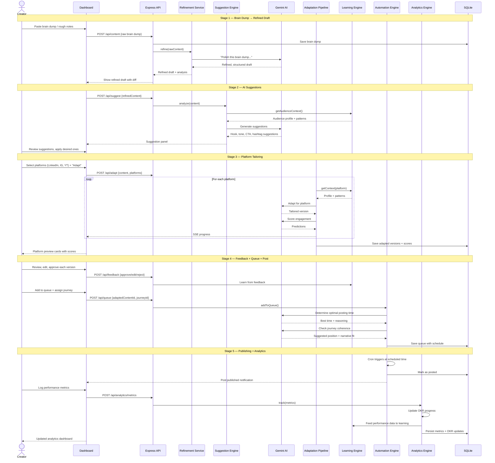

---

## Implementation Phases

### Phase 1 — Foundation + AI Core *(Current Sprint)*
- Project scaffolding with Vite + Express
- AI provider abstraction (Strategy + Factory + Registry)
- **Gemini provider** implementation
- PromptBuilder with context composition
- **RefinementService** (brain dump → refined draft)
- Core OOP hierarchy (BasePlatformAdapter, Registry, Factory)
- **3 adapters: LinkedIn, Instagram, YouTube**
- Basic Suggestion Engine (Hook Analyzer, Tone Advisor, CTA Optimizer)
- Feedback collection system
- Post State Machine
- SQLite persistence with all tables
- Premium dashboard UI: brain dump editor, refined draft view, platform selector, preview cards, suggestion panel, feedback widget

### Phase 2 — Automation + Analytics
- **Automation Engine**: Queue Manager, Post Scheduler, Timing Optimizer
- **Journey Planner** with AI narrative sequencing
- Schedule Calendar UI
- Queue Manager UI (drag-and-drop)
- **Analytics Service**: performance tracking, metrics logging
- **OKR Engine**: objectives, key results, progress tracking
- Analytics Dashboard + OKR Tracker UI
- Remaining adapters: TikTok, Facebook, X/Twitter
- Complete Suggestion Chain (all 7 suggesters)

### Phase 3 — Advanced Intelligence
- **Learning Engine** with full pattern detection
- **Audience Profiler** with per-platform profiles
- **Evolution Tracker** with trend visualization
- Engagement Scorer with AI predictions
- Multi-provider support (OpenAI, Claude)
- A/B variant generation
- Style transfer learning

### Phase 4 — Publishing & Scale *(Future)*
- Direct API publishing to platforms (LinkedIn API, Instagram Graph API, YouTube Data API)
- Webhook-based content ingestion (auto-import from Substack RSS)
- Platform analytics API integration (real engagement data → auto-tracked KRs)
- Multi-user authentication + team workspaces
- AI-generated weekly digest emails

---

## Tech Stack

| Layer | Technology | Reason |
|-------|-----------|--------|
| Frontend | Vite + Vanilla JS | Fast, lightweight, no framework overhead |
| Styling | Vanilla CSS | Maximum control, premium glassmorphism design |
| Backend | Express.js | Mature, flexible, middleware ecosystem |
| AI | @google/generative-ai (Gemini) | Default provider, generous free tier |
| Database | SQLite (better-sqlite3) | Zero-config, file-based, single-user optimized |
| Scheduling | node-cron | Lightweight cron for post scheduling |
| Testing | Vitest | Fast, Vite-native, ESM-first |
| Build | Vite | HMR, fast builds, ESM-native |

---

## Verification Plan

### Automated Tests
```bash
npm test                    # Full Vitest suite
```
- AI provider tests (mock API, verify prompt construction)
- Adapter tests (blog → adapted output matches platform rules)
- Refinement tests (brain dump → structured draft)
- Queue/Journey tests (ordering, scheduling, state transitions)
- Analytics/OKR tests (metric aggregation, progress calculation)
- Pipeline integration tests (end-to-end with mocked AI)
- API endpoint tests with supertest

### Manual Verification
- `npm run dev` → full 4-stage flow with a real brain dump
- Verify refined draft is coherent and well-structured
- Verify adapted outputs match each platform's best practices
- Test queue management: add, reorder, schedule, pause
- Test journey planner: create journey, add posts, verify narrative
- Submit feedback and verify learning engine updates
- Check analytics dashboard with sample metrics
- Create OKRs and verify auto-tracking
- Test responsive design across screen sizes
